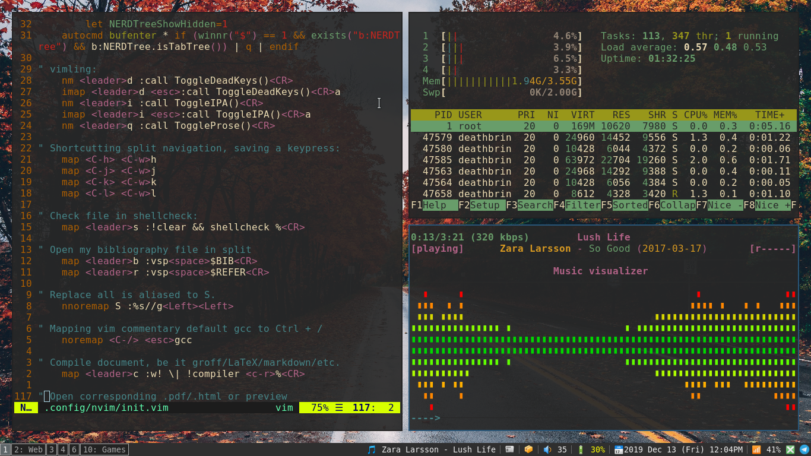

# Trice (incomplete!)

#### Note:
Remmaped reload i3 to `$mod+F12`\
Modify vimwiki to point to Document/Notes instead of home folder.\
Create alias to remove files to a temp directory until cleared.\
Set lock and set wallpaper script in ranger config requires setbg and setlock scripts in path.\

## My Arch linux configuration files, specifically for i3 window manager.
Majority of this config is derived from [Luke Smith's i3wm configuration.](https://github.com/LukeSmithxyz/voidrice).
I have added a lot of tweaks to better suit my need.\
Named Trice because i use two machines, a desktop pc 'Lenovo ThinkCenter' and a laptop 'Lenovo ThinkPad', hence "Trice"!!.\

## Configuration:
Even though i use i3-gaps i have no gaps enabled at default!!\
I feel gaps are a waste of space especially when i am working, and going fullscreen each time is too bothersome.\
I use Luke's build of "st" terminal emulator.\

## i3-movement:
I have remaped `$mod+h/j` keys to move left(horizontal) and `$mod+k/l` to move up(vertical).\
It just feels right.\
Your finger will be on 'j' most of the time, most of the time when you open a window it will be a second window to your right, you will feel the need to go to the left window, thus the 'j'.\
Although i may change this later on.\

